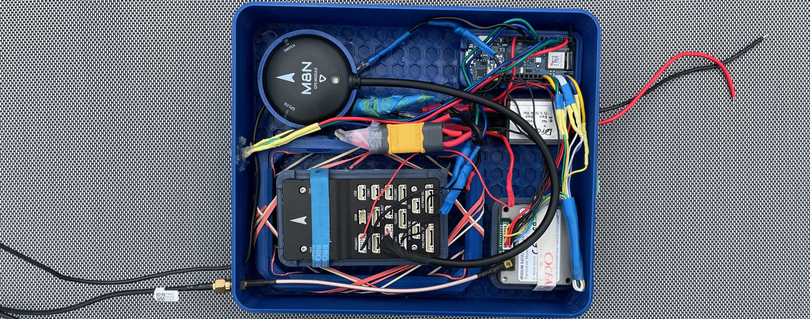
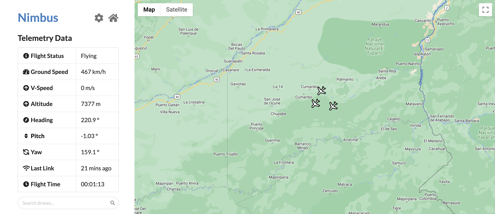

CURRENTLY A WORK IN PROGRESS!
# [Integrated Navigation and Flight UAV Monitoring System (INFUMS)](https://www.projectinfums.com/)

Welcome to the INFUMS repository. This project is a comprehensive data streaming initiative designed to enhance drone operations through robust data logging, real-time tracking, and global communication capabilities. This repository contains all the necessary code, CAD files, documentation, and operations manual.

# Infrastructure Flow

# Table of Contents

# INFUMS: Integrated Navigation and Flight UAV Monitoring System

Welcome to the INFUMS repository. This project aims to enhance drone operations through comprehensive data streaming, robust data logging, real-time tracking, and global communication capabilities.

## Table of Contents

- [About](#about)
- [Project Structure](#project-structure)
  - [.github/workflows](#.githubworkflows)
  - [Cad](#cad)
  - [Embedded](#embedded)
  - [Infrastructure](#infrastructure)
  - [Microservices](#microservices)
  - [Website](#website)

## About

INFUMS (Integrated Navigation and Flight UAV Monitoring System) is designed to improve UAV operations by providing a robust framework for data streaming, logging, tracking, and communication. This system integrates multiple components to ensure seamless UAV monitoring and control.

<MORE ABOUT THE PROJECT>

### Physical Prototype

**[Prototype Components Description (Youtube Video: Click me!)](https://www.youtube.com/watch?v=KGkPDvCn8ZI)**

**[Prototype Demo & Description (Youtube Video: Click me!)](https://www.youtube.com/watch?v=UsFnPDAGzQs)**

I designed, tested, and built this fully functional prototype, incorporating custom-designed 3D-printed components and off-the-shelf parts into a cohesive system. This prototype took approximately 50% of the project's development time and includes custom embedded software and hardware. It is globally connected via satellite, automatically configures itself upon power-up, and is displayed on the website. Designed for harsh environments, it features grounding wires, vibration mounts for the flight controller, and a modular case for easy upgrades or component replacements.

I digitally designed the entire system in CAD, then 3D printed and assembled it. I also documented the prototype extensively, including wiring diagrams and other details. This project was my first foray into 3D printing, satellite communication, drone telemetry protocols, product development, and serverless functions (satellite communication routing to the database), which I had to learn on the fly (pun intended)!

The prototype is a fully functional UAV blackbox, which, similar to an airplane's blackbox, records and monitors flight information but also transmits this information and receives commands via a two-way satellite link (at a cost of significantly less than $10-15k/airplane blackbox). This blackbox system was designed for real-world applications (ex. fleet management). It is modular, reliable, and easy to use, making it ideal for commercial and industrial drone operations in harsh environments. The system includes a flight controller, GPS, Arduino, satellite modem, and a 12 to 5V step-down converter, all of which I researched and sourced.

My design process included:

1) Understanding the project requirements and constraints.
2) Research and investigate possible components and technologies that could be used.
3) Prototype and build proof of concepts of subsystems.
4) Iterate on PoC design based on testing and feedback.
5) Once subsystems are validated, integrate them into a complete system.
6) Test the complete system and iterate on the design based on feedback.
7) Document the design, including CAD files, wiring diagrams, and other relevant information.

#### Photos of the Process

Testing gathering of telemetry data and uploading to cloud

Designed enclosure for telemetry data and upload subsystems

Worked out how to power the system.

Integrated satellite communication

Added power regulation.

Testing satellite communication.

Final prototype with all subsystems integrated.

### Website

### Flow Diagram

**[Integrated System Demo (Youtube Video: Click me!)](https://www.youtube.com/watch?v=riUz8zWrtcc)**

## Project Structure

### .github/workflows

This directory contains GitHub Actions workflows for Continuous Integration and Continuous Deployment (CI/CD). These workflows automate building, and deployment processes to streamline the development lifecycle.

### Cad

The `Cad` directory includes CAD (Computer-Aided Design) files for the physical components of the Blackbox. These files are essential for manufacturing and assembling the hardware. This includes designs for frames, mounts, and other structural parts.

### Embedded

The `Embedded` directory contains code for the embedded systems on the Blackbox. This includes firmware for microcontrollers and other hardware components. The embedded code is responsible for real-time control, sensor data acquisition, and communication with the ground station.

### Infrastructure

The `Infrastructure` directory holds Infrastructure-as-Code (IaC) scripts and configurations for deploying the project's services. This includes scripts for setting up cloud resources, networking configurations, and other deployment-related tasks.

### Microservices

The `Microservices` directory contains the backend microservices that handle various data processing tasks. These microservices are designed to be scalable and modular, allowing for easy integration and maintenance. Each microservice is responsible for a specific aspect of data handling, such as data storage, real-time processing, or analytics.

### Website
The `Website` directory includes the frontend code for the monitoring dashboard. This web application provides a user interface for tracking UAVs in real-time, viewing logged data, and managing system settings. It is built using modern web technologies to ensure a responsive and user-friendly experience.