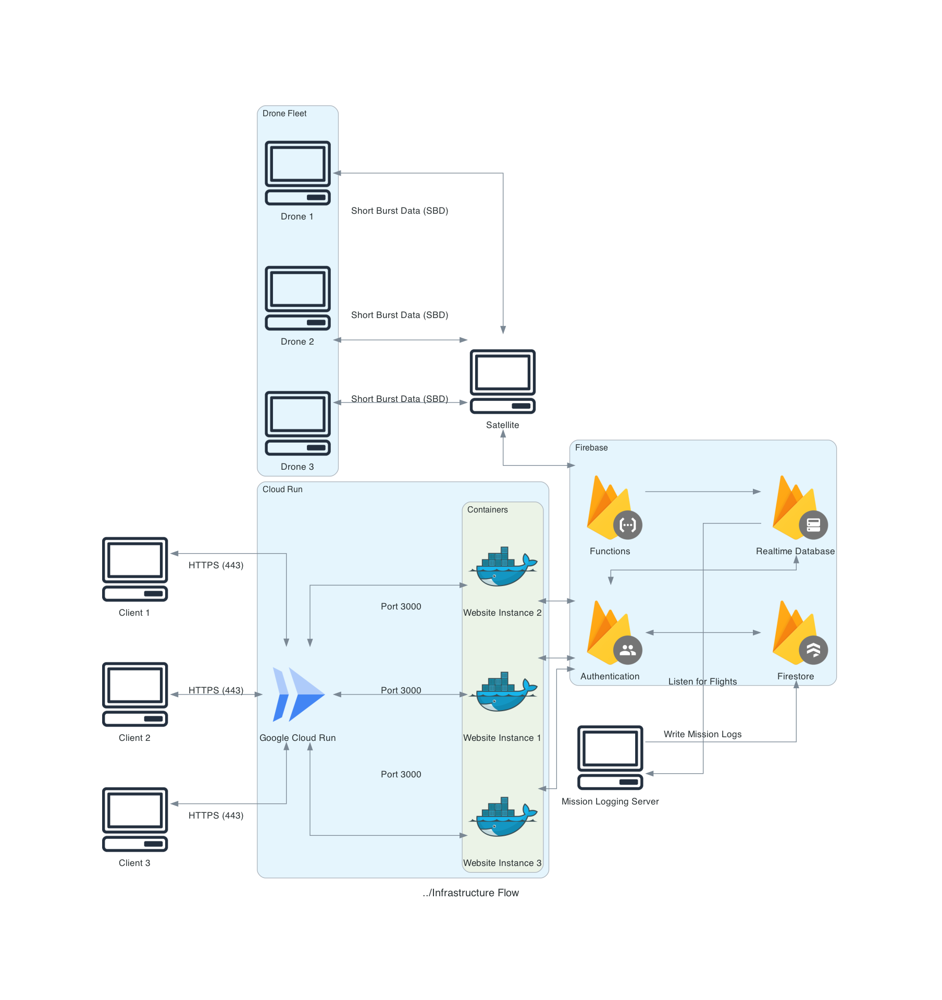

CURRENTLY A WORK IN PROGRESS!
# [Integrated Navigation and Flight UAV Monitoring System (INFUMS)](https://www.projectinfums.com/)

Welcome to the INFUMS repository. This project is a comprehensive data streaming initiative designed to enhance drone operations through robust data logging, real-time tracking, and global communication capabilities. This repository contains all the necessary code, CAD files, documentation, and operations manual.

# Infrastructure Flow
